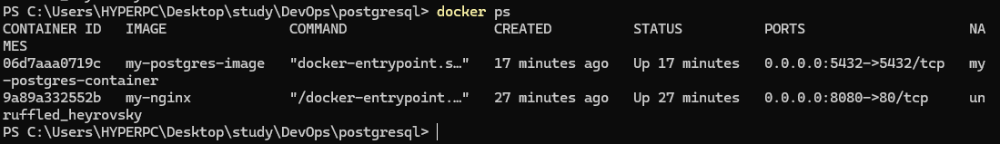
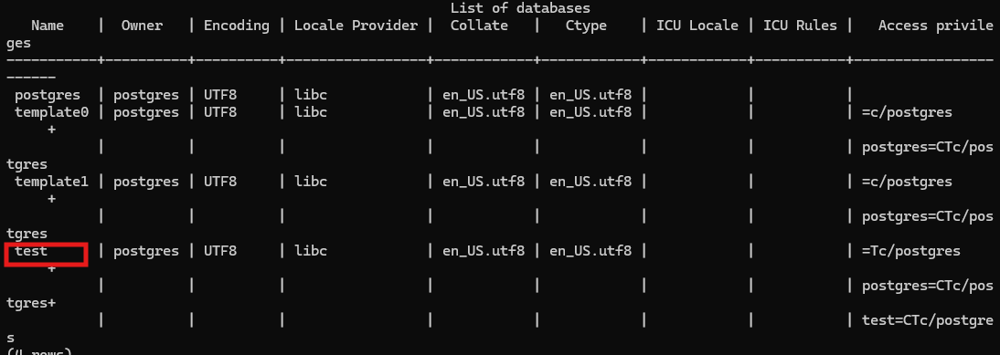
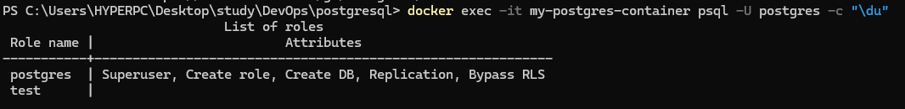

# 1. Запуск контейнеров.

## nginx
- Запускаем сборку контейнера nginx:
```docker build -t my-nginx .```

- Запускаем контейнер nginx: ```docker run -d -p 8080:80 my-nginx```


## postgresql
- Запускаем сборку контейнера postgresql:
```docker build -t my-postgres-image . ```

- Запускаем контейнер postgresql:
```docker run -d --name my-postgres-container -e POSTGRES_PASSWORD=mysecretpassword -p 5432:5432 my-postgres-image ```

## Проверка запущенных контейнеров

- Проверяем запущенные контейнеры командой ``` docker ps ```



- Проверяем, что в postgresql созданна база test ``` docker exec -it my-postgres-container psql -U postgres -c "\l" ```



- Проверяем, что в postgresql создан пользователь test ```docker exec -it my-postgres-container psql -U postgres -c "\du"```

